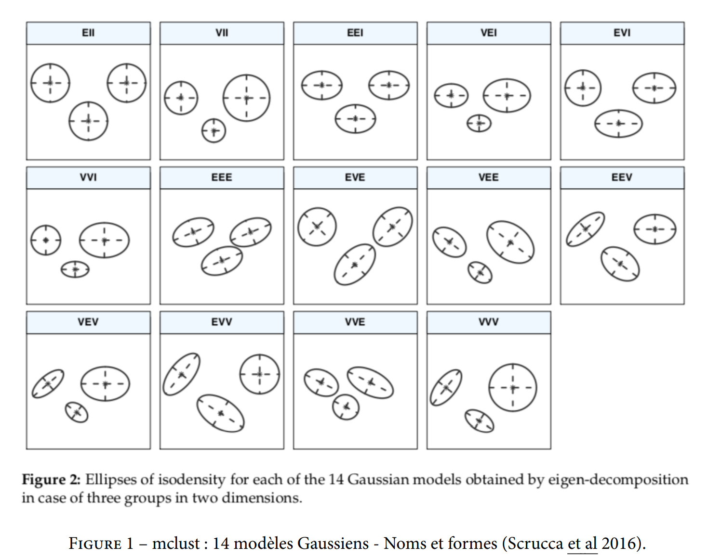
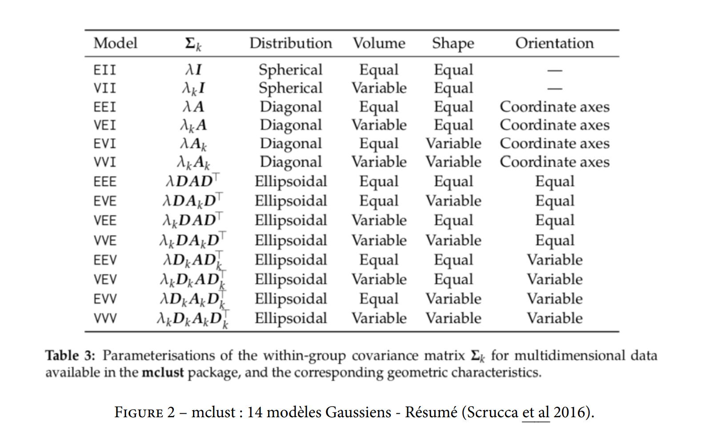

Package

```{r}

pacman::p_load(readxl, data.table, FactoMineR, C50, rpart, mclust, ggplot2, gridExtra, fastcluster, ggdendro, class, mixtools, caret, Factoshiny, R.utils, dendextend,colorspace, R.utils, WeightedCluster, factoextra, JLutils)

```


# I- Non Supervisé

setwd("") # si vous souhaitez changer votre working directory (wd)

```{r remedy001}
setwd(getwd())#Users/33763/OneDrive/Bureau/Git/M2STAT

```
## 1) Importation et visualisation des données 

### Importation

```{r remedy002}

 P53 <- fread("P53_NS.txt.gz", data.table = FALSE)
# row.names(P53) <- P53[, 1] # Changement des noms de lignes "row.names" par les noms des mutants contenus dans la 1ere colonne du jeu de données
P53 <- P53[, -1] # plus de besoin de la 1ere colonne
dim(P53)

```

### Selection du sous-jeu de données

```{r remedy003}
# Sous-ensemble du jeu de donnees sur lequel chaque groupe va travailler
seed <- 1 # Remplacez par votre numero de seed
# Seed permet de tirer toujours le même "hazard"
set.seed(seed)
myP53 <- P53[sample(1:nrow(P53), size = 500), grep("^F3D_", colnames(P53))] #[seed + (51:100)]]
dim(myP53)
str(myP53) # pour vérifier la nature des données, num, char, etc.
any(is.na(myP53)) # permet de savoir s'il y a une valeur manquante


# P53[c(1, 245), c(3, 2000)]
# #on selectionne dans le sous ensemble entre []
# c(1, 245) est un vecteur d'indice qui est (nligne, ncol)

# (1:nrow(p53), size = 500) ==> c'est une selection de ligne et colonne
# vecteur de taille du nombre de lignes (1:nrow(p53) selectionne tout les indinces
# des lignes et size = 500 selectionne 500 elements parmi ces lignes
# grep selectionne un motif dont le nom de colonne correspond a ^F3D_" dans les colnames
# grep renvoi un vecteur d'indice avec les numeros de colonne avec le F3D comme nom
# selectionne un sous ensemble de colonne

```

Centrer les donner est important pour l'analyse en composante principale (ACP)

Centrer réduire c'est bien pour trouver les valeurs abbérantes (c a d soustraire au point la moyenne, et ça se rapproche de l'origine le nuage de point)


### Visualisation du nuage des mutants pour les variables 3 et 17
#### avec ggplot

```{r remedy004}

ggplot(data = myP53, aes_string(x = colnames(myP53)[3], y = colnames(myP53)[17])) +
  geom_point()

```
  
#### avec la fonction plot classique

```{r remedy005}

plot(x = myP53[, colnames(myP53)[3]], y = myP53[, colnames(myP53)[17]], pch = 20)


```
### ACP

```{r remedy006}

nbCP <- 50 # Nombre de composantes principales a representer
resPCA <- PCA(myP53, scale.unit = FALSE, graph = FALSE, ncp = nbCP) # scale.unit est l'argument qui permet de faire une ACP sur données réduites 
PPCAeig <- ggplot(data = cbind.data.frame(Dimension = 1:nbCP, Eigenvalue = resPCA$eig[1:nbCP, 1]), aes(x = Dimension, y = Eigenvalue)) +
  geom_bar(stat = "identity") +
  ggtitle(paste("Ebouli des", nbCP, "premières valeurs propres du groupe", seed))
PPCAind12 <- plot.PCA(resPCA, choix = "ind", label = "none", axes = c(1, 2), title = paste("Representation des individus du groupe", seed))
PPCAind34 <- plot.PCA(resPCA, choix = "ind", label = "none", axes = c(3, 4), title = paste("Representation des individus du groupe", seed))
PPCAvar <- plot.PCA(resPCA, choix = "varcor", label = "var", axes = c(1, 2), title = paste("Representation des variables du groupe", seed))


```

### Question de la normalisation des données ?

```{r remedy007}

range(apply(myP53, 2, sd)) # plus petit et plus grand ecart-type
range(apply(myP53, 2, var)) # plus petite et plus grande variance
myP53Norm <- scale(myP53, center = TRUE, scale = TRUE) # jeu de données centré réduit

```

## 2) CAH

```{r remedy004}

myP53Dist <- dist(myP53) # la matrice des distances entre individus (défaut distance Euclidienne)
myP53Dendro <- hclust(myP53Dist, method = "ward.D2") # le dendrogramme avec la méthode de Ward
plot(myP53Dendro) # visualisation du dendrogrammme

Partition_CAH <- cutree(myP53Dendro, k = 5) # Coupe le dendrogramme en 3 clusters
table(Partition_CAH)

```

## 2) Kmeans

### un premier Kmeans avec 3 centres

```{r remedy005}

resKmeans <- kmeans(myP53, centers = 5)
Partition_Kmeans <- resKmeans$cluster
table(Partition_Kmeans)

```

### Etude de l'influence de k

```{r remedy006}

intra <- rep(NA, l = 15)
intra[1] = kmeans(myP53, centers = 1)$tot.withinss # inertie intra k = 1
for (k in 2:15) intra[k] <- min(replicate(20, 
  kmeans(myP53, centers = k)$tot.withinss)) # pour chaque valeur de k (nombre de centres entre 2 et 15), on fait 20 initialisation

```

### Recherche d'un saut dans l'inertie par méthode "optique"

```{r remedy011}

PKmeansK <- ggplot(cbind.data.frame(K = 1:15, Intra = intra), aes(K, intra)) +
  geom_point() +
  geom_path() +
  ggtitle(paste0("Inertie Intra estimée avec 20 replicats - Groupe ", seed))


```
### Kmeans avec 8 classes d'après l'ébouli d'inertie intra

```{r remedy007}

kmeans.rep <- replicate(20, kmeans(myP53, centers = 8))
best <- which.min(unlist(kmeans.rep['tot.withinss', ])) # Initialisation avec la plus petite inertie intra
resKmeans <- kmeans.rep[, best]
Partition_Kmeans <- resKmeans$cluster
table(Partition_Kmeans)

myP53Part <- cbind.data.frame(as.factor(Partition_Kmeans), myP53)
resPCAPart <- PCA(myP53Part, scale.unit = FALSE, graph = FALSE, quali.sup = 1) # numero variable cluster
plot.PCA(resPCAPart, choix = "ind", label = "none", 
         axes = c(1, 2), 
         title = paste(
           "Representation des individus du groupe", seed),
         habillage = 1) # colorer individus categorie var 1

```

## 3) Mélange Gaussien

 Mclust avec les paramètres par défaut

```{r remedy013}


resMclust <- Mclust(myP53) # ATTENTION ça met beaucoup beaucoup de temps car il teste tous les modèles ...
resMclust # Affichage de l'object resultat avec le modèle choisi par mclust en fonction du critere BIC maximum (attention different du cours)

```

 Sinon vous lui spécifiez le modèle et les nombres de groupes que vous voulez tester
 

```{r remedy008}
 
resMclust <- Mclust(myP53, 
                    modelNames = c("EII", "EEE", "VEE"), 
                    G = c(3:10)) # VOIR cours pour la définition des modèles


```





## 4) Representation du critère BIC

```{r remedy009}
plot(resMclust, what = c("BIC"))

```


## 5) Modèle de mélange sur données débruitées avec l'ACP

```{r remedy010}

PPCAeig <- ggplot(data = cbind.data.frame(Dimension = 1:nbCP, Eigenvalue = resPCA$eig[1:nbCP, 1]), aes(x = Dimension, y = Eigenvalue)) +
  geom_bar(stat = "identity") +
  ggtitle(paste("Ebouli des", nbCP, "premières valeurs propres du groupe", seed))
PPCAeig # Choix du nombres d'axes dans l'ACP en observant un coude dans l'éboulis des valeurs propres par la méthode "optique"
nbCP <- 9


```
## 6) Mclust sur les composantes principes

```{r remedy011}

resPCAMclust <- PCA(myP53, scale.unit = FALSE, graph = FALSE, ncp = nbCP) # On refait tourner l'ACP pour récupérer le nombre d'axes fixés
resMclust <- Mclust(resPCAMclust$ind$coord, G = c(3:10))

```

## 7) Representation du critère BIC

```{r remedy011}

plot(resMclust, what = c("BIC"))


```
## 8) Representation des clusters sur les NbAxes

```{r remedy011}

plot(resMclust, what = c("classification"))

Partition_Mclust <- resMclust$classification
table(Partition_Mclust)


```

 # 4- Comparaison des partitions 

### Table de contingence croisées

```{r remedy014}

table(Partition_CAH, Partition_Kmeans)
table(Partition_CAH, Partition_Mclust)
table(Partition_Mclust, Partition_CAH, Partition_Kmeans)

```

# Matrice de proximité

Fonction pour créer une matrice de proximité entre individus depuis une partition, si 2 individus sont dans le même cluster, la proximité est de 1, 0 sinon


```{r remedy015}

getProxPartition <- function(partition, resPCA){ # partition est un vecteur de classes; resPCA est le résultat de l'ACP
  classes <- unique(partition) # numeros de classes de la partition
  ProxClasses <- lapply(classes, function(classNb) (partition == classNb) %*% t(partition == classNb)) # pour chaque classe, matrice de proximité si deux individus sont ds la classe testee
  Prox <- Reduce("+", ProxClasses) # somme des matrices de proximite pour toutes les classes
  OrderInd <- order(apply(resPCA$ind$coord[, 1:2], 1, sum)) # On reordonne les individus par le 1er plan de l'ACP
  Prox <- Prox[OrderInd, OrderInd]
  return(Prox)
}

```

```{r remedy016}

ProxPartition_CAH <- getProxPartition(Partition_CAH, resPCA = resPCA)
dim(ProxPartition_CAH) # matrice 1000x1000 qui croise les individus avec 1 s'ils sont dans la même classe, 0 sinon 
image(ProxPartition_CAH)
ProxPartition_Kmeans <- getProxPartition(Partition_Kmeans, resPCA = resPCA)
image(ProxPartition_Kmeans)
ProxPartition_Mclust <- getProxPartition(Partition_Mclust, resPCA = resPCA)
image(ProxPartition_Mclust)

```

# Matrice de proximité des trois partitions

```{r remedy017}

ProxPartition <- ProxPartition_CAH + ProxPartition_Kmeans + ProxPartition_Mclust
image(ProxPartition)

```

# Représentation des partitions sur le nuage de l'ACP

```{r remedy018}

myP53Part <- cbind.data.frame(CAH = as.factor(Partition_CAH), Kmeans = as.factor(Partition_Kmeans), Mclust = as.factor(Partition_Mclust), myP53)
resPCAPart <- PCA(myP53Part, scale.unit = FALSE, graph = FALSE, quali.sup = 1:3) # scale.unit est l'argument qui permet de faire une ACP sur données réduites 
PPCAind_CAH <- plot.PCA(resPCAPart, choix = "ind", label = "none", axes = c(1, 2), title = paste("Representation des individus du groupe", seed), habillage = 1)
PPCAind_Kmeans <- plot.PCA(resPCAPart, choix = "ind", label = "none", axes = c(1, 2), title = paste("Representation des individus du groupe", seed), habillage = 2)
PPCAind_Mclust <- plot.PCA(resPCAPart, choix = "ind", label = "none", axes = c(1, 2), title = paste("Representation des individus du groupe", seed), habillage = 3)

grid.arrange(PPCAind_CAH, PPCAind_Kmeans, PPCAind_Mclust, ncol = 3, nrow = 1)


```


# II- Supervisé

```{r remedy024}

P53 <- fread("P53_S.txt.gz", data.table = FALSE)
row.names(P53) <- paste0(P53[, 1], factor(duplicated(P53[, 1]), labels = c("", "_1")))
P53 <- P53[, -1]
table(P53[, ncol(P53)]) # la dernière variable du jeu de données correspond à la variable de classes


```


# Sous-ensemble du jeu de donnees sur lequel chaque groupe va travailler

```{r remedy025}

seed <- 2 # Remplacer par votre numero d'ordinateur (entre 41 et 62)
set.seed(seed) 

```

# Selection de 50 variables 3D

```{r remedy026}

IndicesVar <- grep("^F3D_", colnames(P53))[seed + (51:100)]
IndicesVar <- c(IndicesVar, ncol(P53)) # ajout de la variable de classes (dernière colonne du jeu de données)

```

# Selection d'individus, tous les individus "active" et 
# un sous-ensemble des individus "inactive" pour obtenir 1000 individus

```{r remedy027}

IndicesInd <- c(which(P53$Status == "active"), sample(which(P53$Status == "inactive"), 
                                                      size = 849)) 
myP53 <- P53[IndicesInd, IndicesVar]
dim(myP53)
table(myP53$Status)

```


# ACP

```{r remedy028}

resPCA <- PCA(myP53, scale.unit = TRUE, graph = FALSE, quali.sup = ncol(myP53))
plot.PCA(resPCA, choix = "ind", axes = c(1, 2), label = "none", habillage = ncol(myP53))

```


# Transformer en facteur la variable status

```{r remedy029}

myP53$Status <- as.factor(myP53$Status)


```
# Tirage d?un ensemble d?apprentissage et de son ensemble de test

```{r remedy030}

set.seed(122)
IndicesTrain <- sort(sample(1:1000, size = 750))
IndicesTest <- sort(setdiff(1:1000, IndicesTrain))

myP53Train <- myP53[IndicesTrain, ]
myP53Test <- myP53[IndicesTest, ]

```

# Validation croisée


```{r remedy031}

set.seed(122)
n = 1000
K = 10
size = floor(n/K)
permut = sample(1:n)
sets = list()
for (k in 1:K) sets[[k]]=permut[((k-1)*size+1):(k*size)]

```

# choix de lambda dans Lambda

```{r remedy032}

# Erreurs = 0*Lambda # vecteur de meme taille que Lambda
# for (i in 1:length(Lambda)) {
# 	lambda = Lambda[i]
# 	err = rep(0, l=K)
# 	for (k in 1:K) {
# 		ind.train = unlist(sets[-k])
#        ind.eval = sets[[k]]
# 		classif = train(X[ind.train,], Y[ind.train], lambda)
# 		err[k] = mean(evalue(classif,X[ind.eval])?!=Y[ind.eval])
#        }
#        Erreurs[i] = mean(err) # evalue par CV de l?erreur
# }
# lambda.opt = Lambda[which.min(Erreurs)]

```


# DA

# Entrainement sur donnees apprentissage

```{r remedy033}

modTrain <- MclustDA(
  data = myP53Train[, -which(colnames(myP53Train) == "Status")], #which(colnames(myP53Train != "Status"))
  class = myP53Train$Status, 
  modelType = "EDDA", modelNames = "EEE"
)
summary(modTrain)

```

# Test sur les donnees test

```{r remedy034}

resMclustDA <- predict.MclustDA(modTrain, newdata = myP53Test[, which(colnames(myP53Test) != "Status")])
table(resMclustDA$classification) # classes predites
resMclustDA$z


```
# Pour chaque individu la somme des probabilites a posteriori fait 1

```{r remedy035}

rowSums(resMclustDA$z) # somme des elements en lignes (colSums), i.e. apply(resMclustDA$z, 1, sum)


```
# Comparaison avec les vrais labels

```{r remedy036}

Comp <- table(Vrais = myP53Test$Status, Predits = resMclustDA$classification)
Risk <- (Comp[1, 2] + Comp[2, 1])/sum(Comp) # Risk <- 1 - sum(diag(Comp))/sum(Comp)

Comp
Risk

```


# Arbre de classif 

```{r remedy037}

resTree <- C5.0(
  x =  myP53Train[, -which(colnames(myP53Train) == "Status")],
  y = myP53Train$Status
)
plot(resTree)

resTree10 <- C5.0(
  x =  myP53Train[, -which(colnames(myP53Train) == "Status")],
  y = myP53Train$Status,
  control = C5.0Control(minCases = 10) 
    # smallest number of samples that must be put in at least two of the splits
)
plot(resTree10)

resRpart <- rpart(formula = Status ~ ., data = myP53Train)
plot(resRpart)
summary(resRpart)
predRpart <- predict(resRpart, newdata = myP53Test) # probabilites a posteriori
predRpartLabels <- predRpart[, "active"] < 0.5
predRpartLabels <- factor(predRpartLabels)
predRpartLabels <- factor(predRpartLabels, labels = c("active", "inactive")) 
  # remplacement des labels FALSE et TRUE (ordre alphabetique) par "inactive", "active"
table(predRpartLabels)

```

# Comparaison avec les vrais labels

```{r remedy038}

Comp <- table(Vrais = myP53Test$Status, Predits = predRpartLabels)
Risk <- (Comp[1, 2] + Comp[2, 1])/sum(Comp) # Risk <- 1 - sum(diag(Comp))/sum(Comp)

Comp
Risk

```
